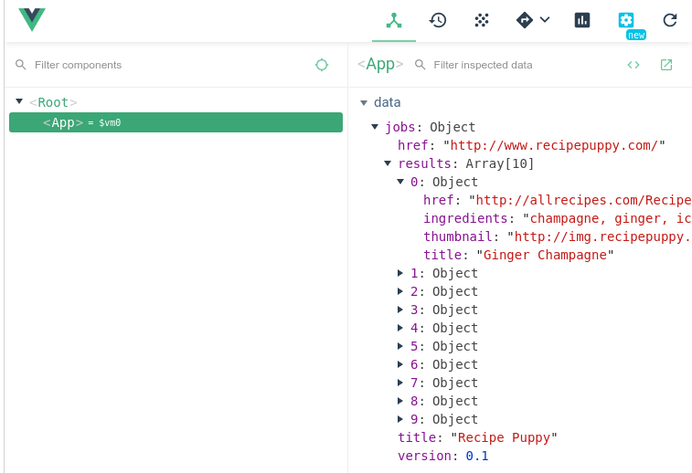

# level1

## Question9
Please create a Vue.js application. This means you will need to generate it by means of a CLI. This application should connect to the following URL: http://www.recipepuppy.com/api/
##### Project setup

cd into level1-9 folder.

```
npm install
```

##### Compiles and hot-reloads 
```
npm run serve
```
##### Check api 

Install Vue Chrome/firefox extension.



## Question 10


